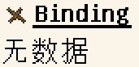
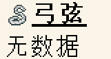
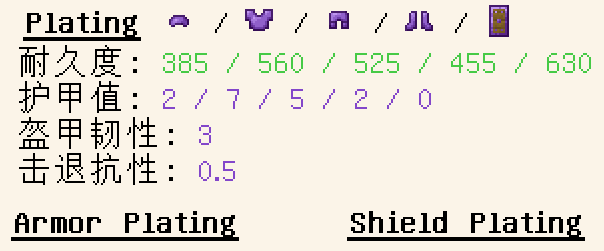
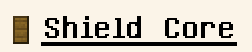

# stats-材料部件

> 材料部件定义**文件位置`data/ModID/tinkering/materials/stats/ID.json`**

```json5
{
    "stats": {
        // 所有部件对象嵌套在"stats"对象内
    }
}
```

> 若一个工具材料的"stats"不包含某一部件的对象，意为该工具材料无法合成此部件

<details>

<summary>部件对象列表(单击展开)</summary>

<ul>
    <li><a href=#头部head>头部(Head)</a></li>
    <dd><a>"tconstruct:head": {...}</a><dd>
    <li><a href=#手柄handle>手柄(Handle)</a></li>
    <dd><a>"tconstruct:handle": {...}</a><dd>
    <li><a href=#绑定binding>绑定(Binding)</a></li>
    <dd><a>"tconstruct:binding": {}</a><dd>
    <li><a href=#弓臂limb>弓臂(Limb)</a></li>
    <dd><a>"tconstruct:limb": {...}</a><dd>
    <li><a href=#弓把grip>弓把(Grip)</a></li>
    <dd><a>"tconstruct:grip": {...}</a><dd>
    <li><a href=#弓弦bowstring>弓弦(Bowstring)</a></li>
    <dd><a>"tconstruct:bowstring": {}</a><dd>
    <li><a href=#镶板plating>镶板(Plating)(仅1.19.2+)</a></li>
    <dd>
    <p>"tconstruct:plating_helmet": {...}</p>
    <p>"tconstruct:plating_chestplate": {...}</p>
    <p>"tconstruct:plating_leggings": {...}</p>
    <p>"tconstruct:plating_boots": {...}</p>
    <p>"tconstruct:plating_shield": {...}</p>
    <dd>
    <li><a href=#夹板maille>夹板(Maille)(仅1.19.2+)</a></li>
    <dd><a>"tconstruct:maille": {}</a><dd>
    <li><a href=#盾牌基底shield-core>盾牌基底(Shield Core)(仅1.19.2+)</a></li>
    <dd><a>"tconstruct:shield_core": {}</a><dd>
</ul>

</details>

## 头部(Head)

> 头部部件包括： 镐头、锤头、小型斧刃、板斧刃、小型剑刃、宽刃、园板、大板

`"tconstruct:head"` 对象名，下为其包含的键值对集合

```json5
{   // 参考：{}tconstruct:wood.json > {}stats > {}tconstruct:head
    "durability": 60,                // 耐久值
    "mining_tier": "minecraft:wood", // 挖掘等级
    "mining_speed": 2.0,             // 挖掘速度
    "melee_attack": 0.0,             // 近战伤害
}
```

匠魂提供了六种挖掘等级: `minecraft`:`wood`/`stone`/`iron`/`diamond`/`netherite`

> 

## 手柄(Handle)

> 手柄部件包括：手柄、坚韧手柄

`"tconstruct:handle` 对象名，下为其包含的键值对集合

```json5
{   // 参考：{}tconstruct:rock.json > {}stats > {}tconstruct:handle
    "durability": -0.1,  // 最终耐久修正值
    "melee_damage": 0.0, // 最终攻击伤害修正值 
    "melee_speed": 0.0,  // 最终攻击速度修正值
    "mining_speed": 0.05 // 最终挖掘速度修正值
}
```

> 

## 绑定(Binding)

> 绑定部件包括：绑定结

`"tconstruct:binding"` 对象名，这是一个空集`{}`

> 

*在1.19.2之前的版本中，该对象名为`"tconstruct:extra"`*

## 弓臂(Limb)

> 弓臂部件包括：弓臂

`"tconstruct:limb` 对象名，下为其包含的键值对集合

```json5
{   // 参考：{}tconstruct:bone.json > {}stats > {}tconstruct:limb
    "durability": 100,  // 耐久值
    "draw_speed": 0.05, // 拉弓速度
    "velocity": -0.05,  // 初速度 - 箭矢速度越高, 造成的伤害越高
    "accuracy": 0.05    // 精确度 - 弓瞄准点距准心的距离
}
```

> 

## 弓把(Grip)

> 弓把部件包括：弓把

`"tconstruct:grip"` 对象名，下为其包含的键值对集合

```json5
{   // 参考：{}tconstruct:copper.json > {}stats > {}tconstruct:grip
    "durability": -0.2, // 最终耐久度修正值
    "accuracy": 0.0,    // 精确度 - 弓瞄准点距准心的距离
    "melee_damage": 0.5 // 近战伤害
}
```

> 

## 弓弦(Bowstring)

> 弓弦部件包括：弓弦

`"tconstruct:bowstring"` 对象名，这是一个空集`{}`

> 

## 镶板(Plating)

> 镶板不是一个部件，而是包含多个相似部件的一个类型
>
> 镶板类型包括：头盔镶板部件、胸甲镶板部件、护腿镶板部件、靴子镶板部件、盾牌镶板部件

对象名列表：

* `"tconstruct:plating_helmet"` 头盔镶板部件

* `"tconstruct:plating_chestplate"` 胸甲镶板部件

* `"tconstruct:plating_leggings"` 护腿镶板部件

* `"tconstruct:plating_boots"` 靴子镶板部件

* `"tconstruct:plating_shield"` 盾牌镶板部件

它们包含相似的键值对集合
```json5
{   // 参考: {}manyullyn.json > {}stats > {}tconstruct:plating_chestplate
    "durability": 560,            // 耐久度
    "armor": 7.0,                 // 护甲值 - 盾牌一般不需要此键值对, 默认值 0
    "toughness": 3.0,             // 盔甲韧性 - 默认值 0
    "knockback_resistance": 0.05  // 击退抗性 - 默认值 0
}
```

> 

## 夹板(Maille)

> 夹板部件包括：夹板

`"tconstruct:maille"` 键名，对应的值为一个空复合标签`{}`

> 

## 盾牌基底(Shield Core)

> 盾牌基底部件包括：盾牌基底

`"tconstruct:shield_core"` 键名，对应的值为一个空复合标签`{}`

> 

# 示例

## tconstruct:manyullyn.json - 玛玉灵

```json
{
  "stats": {
    "tconstruct:binding": {},
    "tconstruct:grip": {
      "accuracy": -0.2,
      "durability": 0.1,
      "melee_damage": 3.5
    },
    "tconstruct:handle": {
      "durability": 0.1,
      "melee_damage": 0.2,
      "melee_speed": -0.05,
      "mining_speed": -0.1
    },
    "tconstruct:head": {
      "durability": 1250,
      "melee_attack": 3.5,
      "mining_speed": 6.5,
      "mining_tier": "minecraft:netherite"
    },
    "tconstruct:limb": {
      "accuracy": -0.15,
      "draw_speed": -0.35,
      "durability": 1250,
      "velocity": 0.25
    },
    "tconstruct:maille": {},
    "tconstruct:plating_boots": {
      "armor": 2.0,
      "durability": 455,
      "knockback_resistance": 0.05,
      "toughness": 3.0
    },
    "tconstruct:plating_chestplate": {
      "armor": 7.0,
      "durability": 560,
      "knockback_resistance": 0.05,
      "toughness": 3.0
    },
    "tconstruct:plating_helmet": {
      "armor": 2.0,
      "durability": 385,
      "knockback_resistance": 0.05,
      "toughness": 3.0
    },
    "tconstruct:plating_leggings": {
      "armor": 5.0,
      "durability": 525,
      "knockback_resistance": 0.05,
      "toughness": 3.0
    },
    "tconstruct:plating_shield": {
      "durability": 630,
      "knockback_resistance": 0.05,
      "toughness": 3.0
    }
  }
}
```

## tconstruct:wood.json - 木

```json
{
  "stats": {
    "tconstruct:binding": {},
    "tconstruct:grip": {
      "accuracy": 0.0,
      "durability": 0.0,
      "melee_damage": 0.0
    },
    "tconstruct:handle": {
      "durability": 0.0,
      "melee_damage": 0.0,
      "melee_speed": 0.0,
      "mining_speed": 0.0
    },
    "tconstruct:head": {
      "durability": 60,
      "melee_attack": 0.0,
      "mining_speed": 2.0,
      "mining_tier": "minecraft:wood"
    },
    "tconstruct:limb": {
      "accuracy": 0.0,
      "draw_speed": 0.0,
      "durability": 60,
      "velocity": 0.0
    },
    "tconstruct:shield_core": {}
  }
}
```
