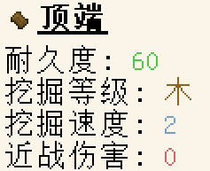
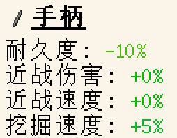
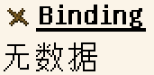
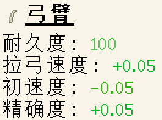
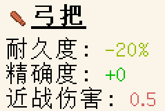
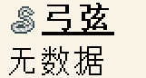
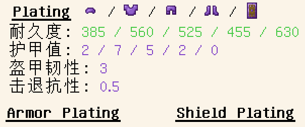

# stats-材料部件

> 材料部件定义**文件位置`data/ModID/tinkering/materials/stats/ID.json`**

## 键名

`stats` (object): 下文所有键与键值对都在其中。若某个部件对象不在其中，则代表该材料的不存在这个部件

> - `tconstruct:head` (object): **头部**部件(Head)，包括镐头、锤头、小型斧刃、板斧刃、小型剑刃、宽刃、园板、大板:
> 
> > <details></details>
> >
> > - `durability` (integer): 耐久度
> > - `mining_tier` (string): 挖掘等级 - [一些补充](#一些补充)
> > - `mining_speed` (number): 挖掘速度
> > - `melee_attack` (number): 近战伤害
> 
> - `tconstruct:handle` (object): **手柄**部件(Handle)，包括手柄、坚韧手柄:
>
> > <details></details>
> >
> > - `durability` (number): 耐久度乘数
> > - `melee_damage` (number): 近战伤害乘数
> > - `melee_speed` (number): 近战速度乘数
> > - `mining_speed` (number): 挖掘速度乘数
> 
> - `tconstruct:binding` (object): **绑定结**部件(Binding) _在1.18.2以下的版本中名为`tconstruct:extra`_:
> 
> > <details></details>
> >
> > 此部件对象为空集
> 
> - `tconstruct:limb` (object): **弓臂**部件(Limb)
> 
> > <details></details>
> >
> > - `durability` (integer): 耐久度
> > - `draw_speed` (number): 拉弓速度
> > - `velocity` (number): 初速度 - 箭矢速度越高, 造成的伤害越高
> > - `accuracy` (number): 精确度 - 弓瞄准点距准心的距离
>
> - `tconstruct:grip` (object): **弓把**部件
> 
> > <details></details>
> >
> > - `durability` (number) 耐久度乘数
> > - `accuracy` (number): 精确度 - 弓瞄准点距准心的距离
> > - `melee_damage` (number): 近战伤害
> 
> - `tconstruct:bowstring` (object): 弓弦部件
> 
> > <details></details>
> >
> > 此部件对象为空集
>
> - `tconstruct:plating_helmet` (object) **头盔镶板**部件(plating_helmet) _(1.19.2+)_
> 
> > <details></details>
> >
> > - `durability` (integer): 耐久值
> > - `armor` (number): 护甲值 - 默认为 0
> > - `toughness` (number): 盔甲韧性 - 默认为 0
> > - `knockback_resistance` (number): 击退抗性 - 默认为 0
> 
> - `tconstruct:plating_chestplate` (object) **胸甲镶板**部件(plating_chestplate) _(1.19.2+)_
> 
> > <details></details>
> >
> > - `durability` (integer): 耐久值
> > - `armor` (number): 护甲值 - 默认为 0
> > - `toughness` (number): 盔甲韧性 - 默认为 0
> > - `knockback_resistance` (number): 击退抗性 - 默认为 0
> 
> - `tconstruct:plating_leggings` (object) **护腿镶板**部件(plating_leggings) _(1.19.2+)_
> 
> > <details></details>
> >
> > - `durability` (integer): 耐久值
> > - `armor` (number): 护甲值 - 默认为 0
> > - `toughness` (number): 盔甲韧性 - 默认为 0
> > - `knockback_resistance` (number): 击退抗性 - 默认为 0
> 
> - `tconstruct:plating_boots` (object) **靴子镶板**部件(plating_boots) _(1.19.2+)_
> 
> > <details></details>
> >
> > - `durability` (integer): 耐久值
> > - `armor` (number): 护甲值 - 默认为 0
> > - `toughness` (number): 盔甲韧性 - 默认为 0
> > - `knockback_resistance` (number): 击退抗性 - 默认为 0
> 
> - `tconstruct:plating_shield` (object) **盾牌镶板**部件(plating_shield) _(1.19.2+)_
> 
> > <details></details>
> >
> > - `durability` (integer): 耐久值
> > - `toughness` (number): 盔甲韧性 - 默认为 0
> > - `knockback_resistance` (number): 击退抗性 - 默认为 0
> 
> - `tconstruct:maille` (object): **夹板**部件(maille) _(1.19.2+)_
> 
> > <details></details>
> >
> > 此部件对象为空集
> 
> - `tconstruct:shield_core` (object) **盾牌基底**部件(shield_core)
> 
> > <details></details>
> >
> > 此部件对象为空集

### 一些补充

匠魂提供了六种挖掘等级`minecraft`:`wood`/`stone`/`iron`/`diamond`/`netherite`，对应原版的木/石/铁/钻石/下界合金挖掘等级

## 例

_摘自竹(tconstruct:bamboo)的工具材料部件文件_。该工具材料可制作的部件有**弓把**、**弓臂**、**盾牌核心**，各部件的详细属性在代码块中...~~太多了不想讲~~

```json
{
  "stats": {
    "tconstruct:grip": {
      "accuracy": 0.05,
      "durability": -0.05,
      "melee_damage": 0.75
    },
    "tconstruct:limb": {
      "accuracy": -0.05,
      "draw_speed": 0.1,
      "durability": 70,
      "velocity": -0.05
    },
    "tconstruct:shield_core": {}
  }
}
```

_摘自铜(tconstruct:copper)的工具材料部件文件_。该工具材料可制作的部件有**绑定**、**弓把**、**手柄**、**头部**、**弓臂**、**夹板**、**靴子镶板**、**胸甲镶板**、**头盔镶板**、**护腿镶板**、**盾牌镶板**、**头颅**

```json
{
  "stats": {
    "tconstruct:binding": {},
    "tconstruct:grip": {
      "accuracy": 0.0,
      "durability": -0.2,
      "melee_damage": 0.5
    },
    "tconstruct:handle": {
      "durability": -0.2,
      "melee_damage": 0.05,
      "melee_speed": 0.0,
      "mining_speed": 0.1
    },
    "tconstruct:head": {
      "durability": 210,
      "melee_attack": 0.5,
      "mining_speed": 5.0,
      "mining_tier": "minecraft:iron"
    },
    "tconstruct:limb": {
      "accuracy": 0.0,
      "draw_speed": -0.1,
      "durability": 210,
      "velocity": 0.05
    },
    "tconstruct:maille": {},
    "tconstruct:plating_boots": {
      "armor": 1.0,
      "durability": 169
    },
    "tconstruct:plating_chestplate": {
      "armor": 3.0,
      "durability": 208
    },
    "tconstruct:plating_helmet": {
      "armor": 1.0,
      "durability": 143
    },
    "tconstruct:plating_leggings": {
      "armor": 2.0,
      "durability": 195
    },
    "tconstruct:plating_shield": {
      "durability": 234
    },
    "tconstruct:skull": {
      "armor": 2,
      "durability": 145
    }
  }
}
```