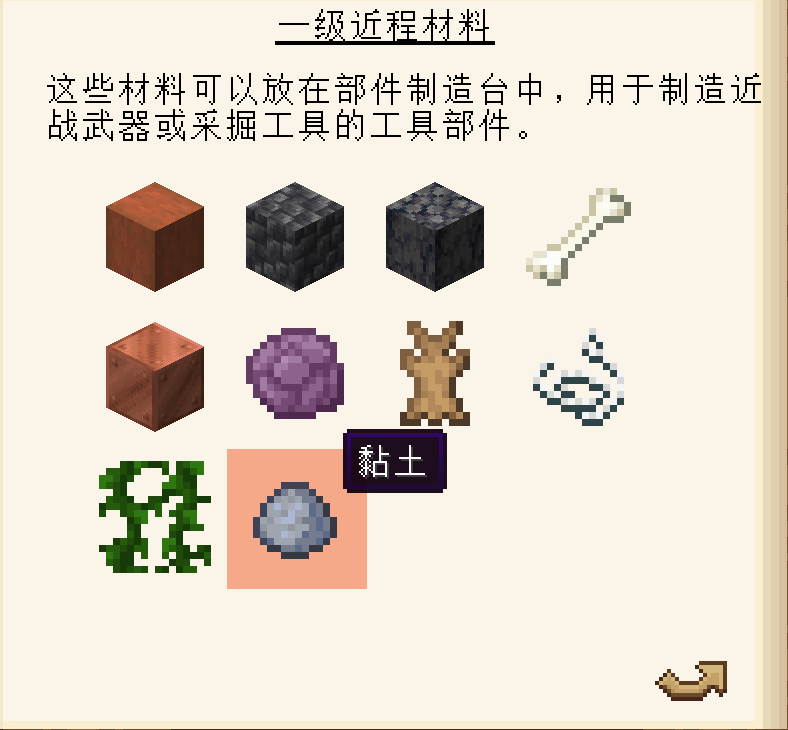
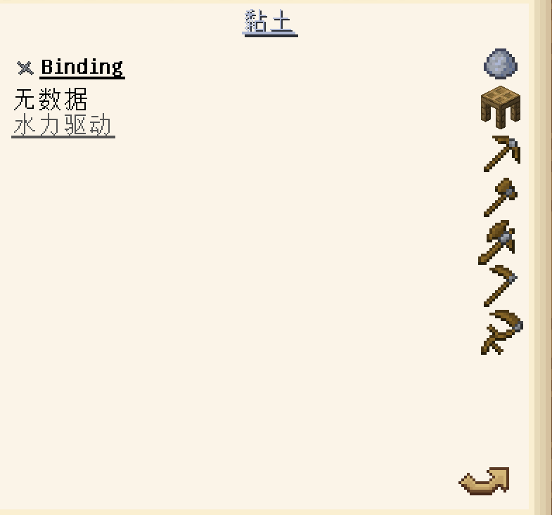
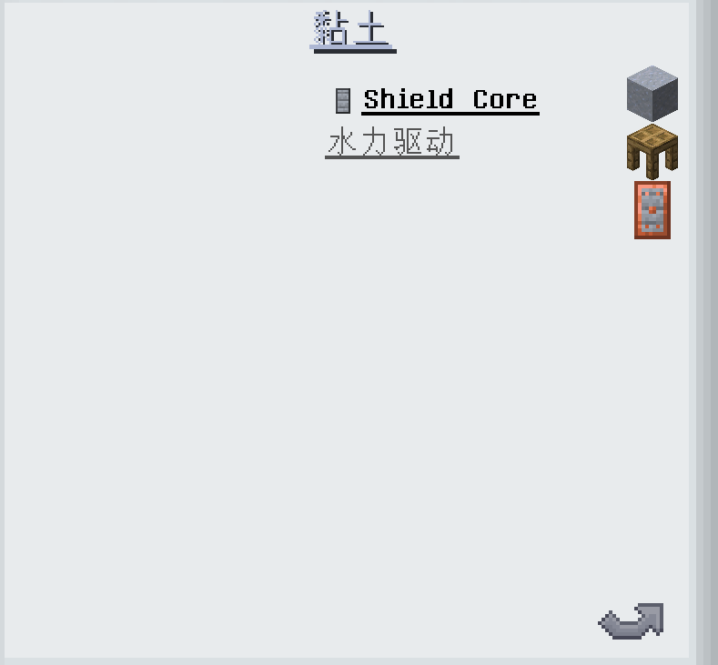
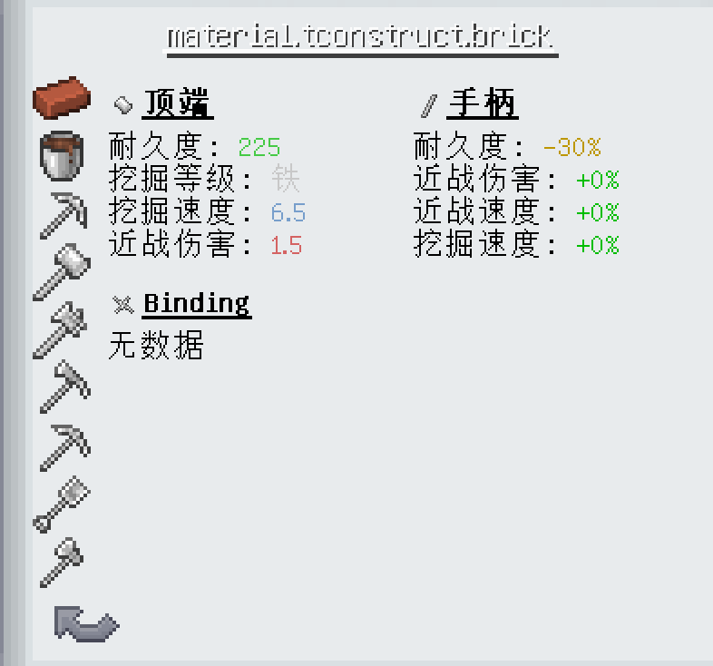

# 前言

> 什么是 materials ?

参考: [材料:工具材料](https://www.mcmod.cn/item/list/3725-1-1016623.html) 下文称为"材料"或"工具材料"

> 什么是 对象 数组 键值对 ?

参考: [JSON 语法](https://www.runoob.com/json/json-syntax.html)

<details>

<summary>目录(单击展开)</summary>
    <ol>
        <li><a href=#前言>前言</a></li>
        <li><a href=#开始之前>开始之前</a></li>
        <li><a href=#正式开始>正式开始</a></li>
        <li><a href=#创建材料定义-definitionmd>创建材料定义-definition</a></li>
        <li><a href=#创建材料部件-statsmd>创建材料部件-stats</a></li>
        <li><a href=#创建材料特性-traitsmd>创建材料特性-traits</a></li>
    </ol>

</details>

# 开始之前

Ciallo ～(∠·ω< )⌒☆ 这里是**小狼娘 fufu**~，你也可以叫我**fufu**

> 本篇使用的范例材料为 `tconstruct:clay`
>
> <details>
>
> <summary>关联的文件(单击展开)</summary>
>
> <ol>
>    <li><a href=../Packs/data/tconstruct/tinkering/materials/definition/clay.json> 定义(definition) </a></li>
> </ol>
>
> </details>

# 正式开始

确认你的`模组名称`和`材料名称`，下文将分别使用`ModID`和`ID`来代替！将注册一个名为`ModID:ID`的材料

> 在 `客户端/data/ModID/tinkering/materials/`下的`definition/`&`stats/`&`traits/`中各新建一个`ID.json`文件
>
> 在 `客户端/assets/ModID/tinkering/materials/`中新建一个与上文`ID.json`文件

确保这些新建的文件名为你所需的`材料名称`且**同名**之后，接着开始下一步

# 创建材料定义-**definition**

> 打开`客户端/data/.../definition/ID.json`参考[definition.md](./Materials/definition.md)创建一个工具材料定义文件

[示例 >>>](../Packs/data/tconstruct/tinkering/materials/definition/clay.json)

```json
{
  "craftable": true,
  "tier": 1,
  "sortOrder": 9,
  "hidden": false
}
```

# 创建材料部件-**stats**[(.md)](./Materials/stats.md)

> 打开`客户端/data/.../stats/ID.json`参考

[示例 >>>](../Packs/data/tconstruct/tinkering/materials/stats/clay.json)

```json
{
  "stats": {
    "tconstruct:binding": {},
    "tconstruct:shield_core": {}
  }
}
```

# 创建材料特性-**traits**[(.md)](./Materials/traits.md)

> 打开`客户端/data/.../traits/ID.json`写入以下内容创建一个工具材料特性文件

[示例 >>>](../Packs/data/tconstruct/tinkering/materials/traits/clay.json)

```json
{
  "default": [
    {
      "level": 1,
      "name": "tconstruct:hydraulic"
    }
  ]
}
```

# 承上启下

到此为止，我们所自定义的材料已经被成功的创建了出来

**加载数据包并重启游戏**，如果编写正确且材料未隐藏，将会发现你所自定义的材料已经出现在了对应的匠魂宝典之中

> <details>
>
> <summary><a>本篇使用的范例材料"tconstruct:clay"展示(单击展开)</a></summary>
>
> > defintion/clay.json 定义的材料等级和目录位置
>
> 
>
> > stats/clay.json 定义的部件与 traits/clay.json 定义的特性
>
> 
>
> 
>
> </details>

但此时它的材质和名称都为最原始的状态

> 此处黏土的材质和语言文件已经完善，原因是匠魂本身就有定义了黏土材料，只是未为其添加任何部件
>
> 如果是自定义的新材料，语言显示将是本地化键，材质显示将是灰度图
>
> <details>
>
> <summary><a>例(单击展开)</a></summary>
>
> 
>
> </details>

因此

我们仍将进行下去，为其定义语言文件、配方和材质

# 创建材料语言文件

# 创建材料配方

# 创建材料材质
