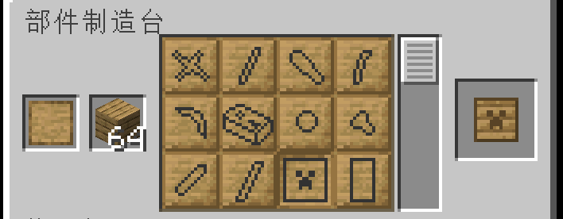
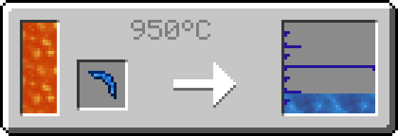

# 指引

1. **如果需要材料的部件在部件制造台上合成和工匠站/砧上修复（如下图 1 和图 2），请先确保该材料定义的`craftable`为`true`，跳转至[材料配方](#material)**

> 当`craftable`为`false`时，该材料仅可用于修复（如图 2）

图一



图二


2. **如果需要材料的部件使用浇筑合成（如下图），跳转至[材料浇筑配方](#material-fluid)**


3. **如果要使材料的部件在炉中融化成液体（如下图），跳转至[材料融化配方](#material-melting)**



---

# <span id=material>材料配方(material)</span>

此配方定义一个材料与物品的关联。使物品可用于[**部件制造**](../Gammers.md/#部件制造)和[**工具修复**](../Gammers.md/#工具修复)

## 键名

- `type` (string): `tconstruct:material`
- `ingredient` ([ingredient](../Gammers.md/#ingredient)): 物品输入，一般情况下一个或一类物品只与一种材料相关
- `value` (integer): 一个物品所能提供的以"锭"为基础的值。默认为 1
- `needed` (integer): 制造一个部件需要的以"锭"为基础的值。默认为 1
- `material` ([materialID](../Gammers.md/#materialid)): 关联的材料命名空间
- `leftover` ([itemOutput](../Gammers.md/#itemoutput)): (可选)当"needed"不是"value"的倍数，返还物品

## 例

将铁粒(#forge:nuggets/iron)与铁工具材料(tconstruct:iron)关联起来。制造 1 个部件需要 9 个物品

因为铁工具材料(tconstruct:iron)定义文件中的`craftable`为`false`，所以此配方仅用于**工具修复**

```json
{
  "type": "tconstruct:material",
  "ingredient": {
    "tag": "forge:nuggets/iron"
  },
  "value": 1,
  "needed": 9,
  "material": "tconstruct:iron"
}
```

将黏土块(minecraft:clay)与黏土工具材料(tconstruct:clay)关联起来。制造 1 个部件需要 4 个物品，当提供的值大于当前制造的部件所需的值，返还溢出值数量的黏土球(minecraft:clay_ball)

因为黏土工具材料(tconstruct:clay)定义文件中的`craftable`为`true`，所以此配方用于**部件制造**和**工具修复**

```json
{
  "type": "tconstruct:material",
  "ingredient": {
    "item": "minecraft:clay"
  },
  "value": 4,
  "needed": 1,
  "leftover": {
    "item": "minecraft:clay_ball"
  },
  "material": "tconstruct:clay"
}
```

---

# <span id=material-fluid>材料浇筑配方(material_fluid)</span>

定义一个或两个材料与液体的关联。使液体可用于**部件浇筑**

## 键名

- `type` (string): `tconstruct:material_fluid`
- `fluid` ([fluidIngredient](../Gammers.md/#fluidingredient)): 输入流体
- `output` ([materialID](../Gammers.md/#materialid)): 关联输出的工具材料
- `input` ([materialID](../Gammers.md/#materialid)): (可选)关联输入的工具材料。若此项不为空，则液体浇筑在`input`材料部件输出`output`对应的材料部件
- `temperature` (integer): 使这个配方可用需要的最低温度

## 例

关联融化铁流体("tconstruct:molten_iron")和铁工具材料("tconstruct:iron")。浇筑一个完整部件需要 90mB 的流体，且温度需要大于等于 800

```json
{
  "type": "tconstruct:material_fluid",
  "fluid": {
    "amount": 90,
    "tag": "forge:molten_iron"
  },
  "output": "tconstruct:iron",
  "temperature": 800
}
```

# <span id=material-melting>材料冶炼配方(material_melting)</span>

定义一个材料与液体的关联。使材料的部件可用于**部件冶炼**

## 键名

- `type` (string): `tconstruct:material_melting`
- `input` ([materialID](../Gammers.md/#materialid)): 将被融化的工具材料
- `result` ([fluidStack](../Gammers.md/#fluidstack)): 输出的流体
- `temperature` (integer): 使这个配方可用需要的最低温度

## 例

关联融化铁流体("tconstruct:molten_iron")和铁工具材料("tconstruct:iron")。融化一个部件产出 90mB 的流体，且温度需要大于等于 800

```json
{
  "type": "tconstruct:material_melting",
  "input": "tconstruct:iron",
  "result": {
    "amount": 90,
    "fluid": "tconstruct:molten_iron"
  },
  "temperature": 800
}
```

---
